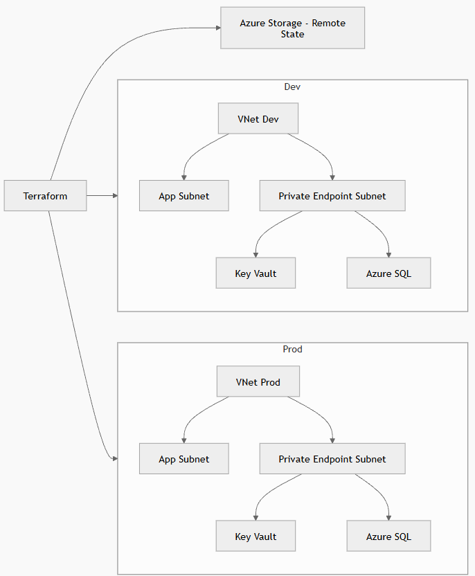
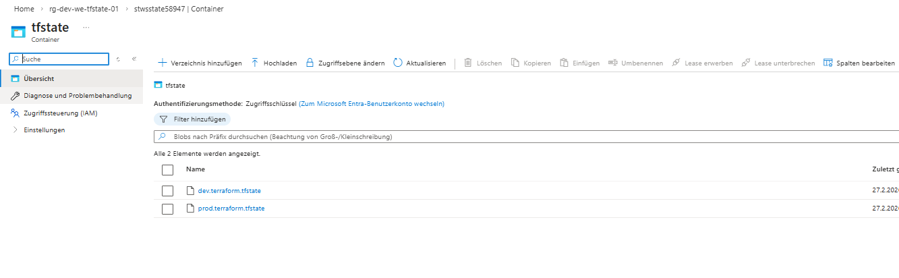
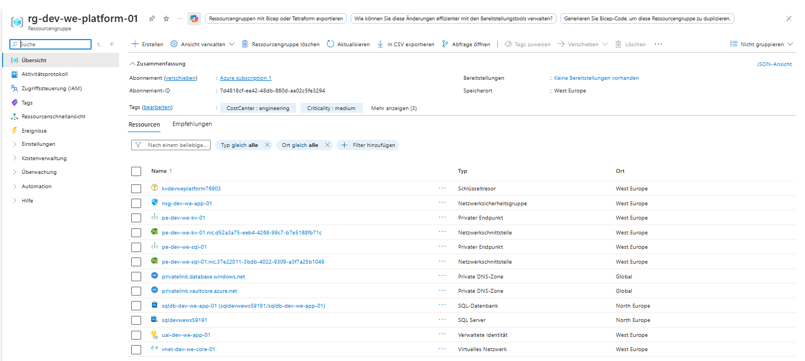
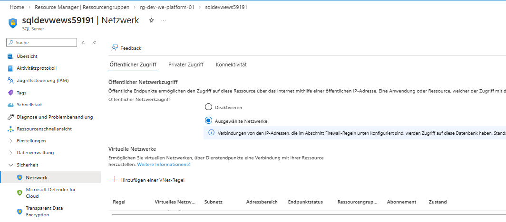
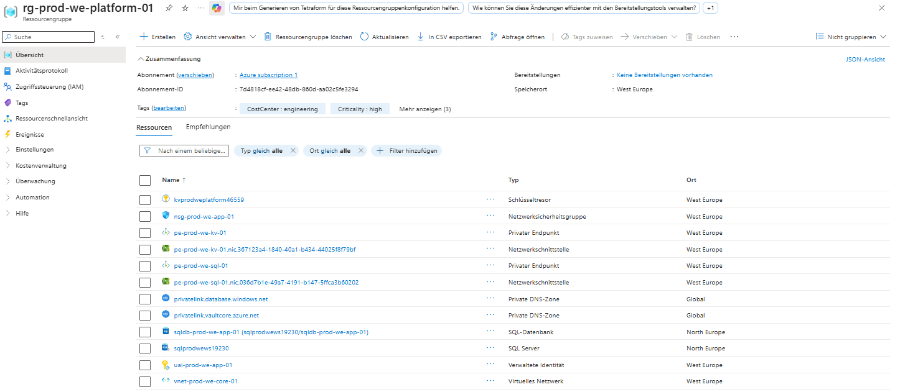
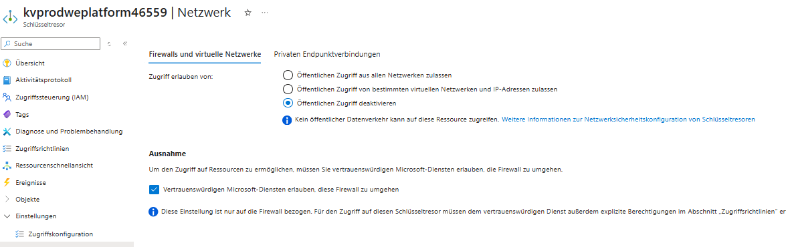
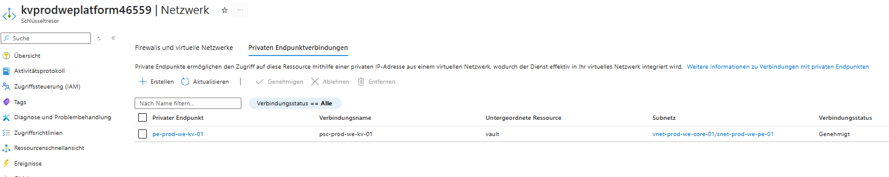

# WorkSphere  
## Azure Platform Engineering Projekt

---

## Überblick

Dieses Repository dokumentiert den Aufbau einer produktionsnahen Azure-Plattform für das fiktive B2B-SaaS-Unternehmen **WorkSphere**.

Ziel des Projekts war es, eine sichere, skalierbare und standardisierte Cloud-Grundlage zu entwickeln, die als Basis für zukünftige Applikations-Deployments dient.

Der Fokus liegt bewusst auf:

- Cloud-Architektur  
- Security by Design  
- Governance  
- Infrastructure as Code (Terraform)  

---

## Zielsetzung

Die Plattform sollte:

- Entwicklungs- und Produktionsumgebungen strikt trennen  
- Sensible Ressourcen nicht öffentlich exponieren  
- Secrets sicher verwalten  
- Teamfähig über Remote State betrieben werden  
- Governance-Standards einhalten  
- Vollständig reproduzierbar per Terraform bereitgestellt werden  

Dieses Projekt demonstriert meine Fähigkeiten im Bereich:

- Azure Cloud Engineering  
- Plattformarchitektur  
- Terraform & Modularisierung  
- RBAC & Identity Design  
- Private Networking  
- Enterprise Governance  

---

# Architektur

## High-Level Architekturdiagramm

# Kernkomponenten

## Networking

- Separates Virtual Network pro Environment  
- Subnet-Trennung:
  - Application Subnet  
  - Private Endpoint Subnet  
- Network Security Group am Application Subnet  
- Private DNS Zones für:
  - Azure Key Vault  
  - Azure SQL  

---

## Security

- Azure Key Vault mit aktiviertem RBAC  
- User Assigned Managed Identity für Applikationen  
- Rollenbasiertes Berechtigungsmodell  
- Azure AD Integration für SQL Server  
- Public Network Access für SQL in Prod deaktiviert  

---

## Datenbank

- Azure SQL Server getrennt für Dev und Prod  
- Private Connectivity über Private Endpoint  
- SQL Admin Passwort im Key Vault gespeichert  

---

## Remote State

- Separater Bootstrap-Stack  
- Azure Storage Account mit Blob Container  
- Versionierung aktiviert  
- Separate State Files:
  - `dev.terraform.tfstate`
  - `prod.terraform.tfstate`

---

# Architekturentscheidungen und Begründungen

## 1. Strikte Dev/Prod-Trennung

### Problem

Vermischte Umgebungen erhöhen Risiko und Komplexität.

### Entscheidung

- Separate VNets  
- Separate SQL Server  
- Separate Key Vaults  
- Separate Terraform State Files  

### Begründung

Minimierung des Blast Radius und realistische Enterprise-Architektur.

---

## 2. Private Networking als Standard

### Problem

Öffentlich erreichbare PaaS-Ressourcen erhöhen die Angriffsfläche.

### Entscheidung

- Einsatz von Private Endpoints  
- Nutzung von Private DNS Zones  
- Deaktivierung von Public Access in Prod  

### Begründung

Zero-Trust-Ansatz und Minimierung externer Angriffsflächen.

---

## 3. RBAC-First Strategie

### Problem

Access Policies sind nicht konsistent mit moderner Azure Governance.

### Entscheidung

- Aktiviertes RBAC für Key Vault  
- Rollenbasierte Zugriffskontrolle  
- Managed Identities statt Secrets im Code  

### Begründung

Zentrales Identity- und Berechtigungsmodell über Azure AD.

---

## 4. Modularisierung mit Terraform

### Problem

Monolithische Terraform-Strukturen sind schwer wartbar.

### Entscheidung

- Wiederverwendbare Module (z. B. Netzwerkmodul)  
- Klare Trennung von Bootstrap, Dev und Prod  

### Begründung

Wartbarkeit, Skalierbarkeit und Wiederverwendbarkeit.

---

# Dev vs. Prod – Unterschiede

| Bereich | Dev | Prod |
|----------|------|-------|
| Remote State | dev.terraform.tfstate | prod.terraform.tfstate |
| SQL SKU | Basic | S0 |
| Key Vault Retention | 7 Tage | 30 Tage |
| Purge Protection | deaktiviert | aktiviert |
| Criticality Tag | medium | high |
| Netzwerkbereich | 10.10.0.0/16 | 10.20.0.0/16 |

---

# Governance

## Naming Convention
resource-type-environment-region-workload-instance

### Beispiele
rg-prod-we-platform-01
vnet-dev-we-core-01

## Einheitliche Tags

Alle Ressourcen enthalten:

- Environment  
- Owner  
- CostCenter  
- Project  
- Criticality  

**Ziel:** Transparenz, Kostenkontrolle und Enterprise-Readiness.

---

# Projektstruktur

infra/
├── bootstrap/ # Remote State Infrastruktur
├── dev/ # Entwicklungsumgebung
├── prod/ # Produktionsumgebung
└── modules/
└── network/ # Wiederverwendbares Netzwerkmodul

---

# Sicherheitsprinzipien

- Private Endpoints statt Public Exposure  
- RBAC statt Access Policies  
- Azure AD als zentrale Identitätsbasis  
- Secrets ausschließlich im Key Vault  
- Strikte Environment-Isolation  
- Deaktivierter Public Access für SQL in Prod  

---

# Architektur- und Implementierungsnachweise

## Remote Terraform State

### Azure Storage – State Container

Getrennte State-Dateien für Dev und Prod zur sicheren Environment-Isolation.

---

## Architekturübersicht

### Plattform-Architektur (Dev & Prod)

Darstellung der vollständigen Infrastruktur inklusive Remote State, Terraform-Anbindung, VNet-Struktur und Private Endpoints.

---

# Dev Umgebung

## Ressourcenübersicht – Dev

Alle bereitgestellten Ressourcen der Entwicklungsumgebung inklusive VNet, NSG, Private Endpoints, SQL und Key Vault.

---

## Key Vault – RBAC & Identity Modell (Dev)

Rollenbasierte Zugriffskontrolle (RBAC) mit Managed Identity für Applikationen.

---

## SQL Server – Private Endpoint (Dev)

Private Connectivity über Private Endpoint zur Minimierung der Angriffsfläche.

---

## SQL Server – Öffentlicher Zugriff eingeschränkt

Konfiguration des Public Network Access gemäß Security-Policy.

---

# Prod Umgebung

## Ressourcenübersicht – Prod

Produktionsumgebung mit erhöhter Sicherheitskonfiguration (z. B. Purge Protection, höheres SQL SKU, Criticality Tag = high).

---

## Key Vault – Netzwerk-Konfiguration (Prod)

Public Access deaktiviert, Zugriff ausschließlich über Private Endpoint.

---

## Key Vault – Private Endpoint (Prod)

Genehmigte Private Endpoint-Verbindung innerhalb des dedizierten Subnets.

---

## SQL Server – Private Endpoint (Prod)

Private Anbindung des SQL Servers an das Produktions-VNet.

---

## SQL Server – Public Network Access deaktiviert (Prod)

Öffentlicher Zugriff vollständig deaktiviert gemäß Zero-Trust-Prinzip.

# Zusammenfassung

Dieses Projekt demonstriert praxisnahe Erfahrung in:

- Azure Plattformarchitektur  
- Secure-by-Design Infrastruktur  
- Terraform & Infrastructure as Code  
- RBAC & Identity Design  
- Private Networking  
- Environment Isolation  
- Remote State & Teamfähigkeit  
- Governance & Standardisierung  

Die Architektur orientiert sich an realistischen Unternehmensanforderungen und zeigt meine Fähigkeit, sichere und skalierbare Azure-Plattformen professionell zu konzipieren und umzusetzen.
